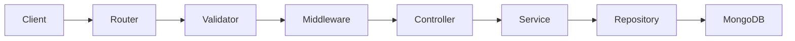

# Code Snippet - Node.js REST API

[](https://nodejs.org)
[](#run)

---

## What is this?

Imagine a simple platform where people can create an account, write posts, and leave comments - like a lightweight blog or community board. This project is the **backend engine** that makes all of that work behind the scenes.

When a user clicks "Sign Up," something has to save their details, send them a verification email, and make sure no one else can pretend to be them. When they write a post, something has to store it, let them edit it later, and make sure nobody else can delete it. This project handles all of that.


---

## What does it actually do?

Here is everything a user can do, in plain terms:

**Account**
- Create an account with an email and password
- Receive a one-time code by email to confirm the account is real
- Log in securely and get a private access token
- Change their password (only while logged in)

**Posts**
- Write a post and publish it
- Browse their own posts with page-by-page navigation
- Edit or delete a post - but only their own
- View a single post along with how many comments it has

**Comments**
- Leave a comment on any post
- Edit or delete their own comments - nobody else's

---

## Why was this built this way?

Most beginner tutorials put everything in one file. Routes talk directly to the database, passwords accidentally end up in API responses, and nobody checks whether the person asking to delete a post actually owns it.

This project was built to show what a real backend looks like when it's done carefully:

- **No password ever leaves the server** - API responses are filtered so sensitive fields are always stripped out
- **You can only touch your own content** - the server checks ownership before every edit or delete
- **Emails are sent in the background** - sign-up responds instantly; the verification email is handled separately so nothing slows the user down
- **The code is split into clear layers** - each part of the code has one job, making it easy to read, test, and extend

---

## Built with

| What | Why |
|------|-----|
| **Node.js 18** | Fast, widely used server runtime |
| **TypeScript** | Catches bugs before the code even runs |
| **Express** | Industry-standard web framework for Node |
| **MongoDB + Mongoose 8** | Flexible document database, modern ODM |
| **JWT + bcrypt** | Secure login tokens and password hashing |
| **Pino** | Structured logging ready for production log systems |
| **Nodemailer** | Sends verification emails via SMTP |
| **Jest + Supertest** | 19 automated tests - no real database or email server needed |
| **Docker** | Run the whole stack with one command |
| **GitHub Actions** | Automatically builds and tests on every code change |

---

## How a request travels through the code

Every incoming request passes through a predictable chain before anything is saved or returned.



**Example - editing a post:**

1. **Router** confirms the route, checks the JWT token, and validates the post ID format
2. **Middleware** loads the post from the database and checks that the requesting user owns it (403 if not)
3. **Controller** receives the request and passes it to the service - no second database trip needed
4. **Service** applies the business rule and calls the repository
5. **Repository** saves the change and returns the updated document
6. **Controller** sends the result back to the client

Validators only check that inputs are the right shape. They never load database records. That's intentional.

---

## Project structure

```
code-snippet-node/
├── src/
│   ├── index.ts                  # Entry point - starts the server, handles shutdown signals
│   ├── app.ts                    # Express app factory (also used directly in tests)
│   ├── database.ts               # MongoDB connect / disconnect
│   ├── config/
│   │   ├── env.ts                # Loads .env, fails fast if anything required is missing
│   │   ├── logger.ts             # Pino structured logger
│   │   ├── swagger.ts            # OpenAPI specification
│   │   └── swagger.setup.ts      # Mounts /api/docs in development only
│   ├── controllers/              # Thin HTTP handlers - receive request, call service, send response
│   ├── services/                 # Business logic - rules about what is and isn't allowed
│   ├── repositories/             # All database reads and writes in one place
│   ├── middlewares/              # JWT auth, resource loading, ownership checks
│   ├── validators/               # Input shape checks only (no database calls)
│   ├── models/                   # Mongoose schemas
│   ├── dto/                      # What the API actually returns (passwords stripped here)
│   ├── errors/                   # Typed error classes (404, 403, 401, 422)
│   ├── routers/                  # Route definitions and middleware chains
│   └── utils/                    # Password hashing, OTP generation, mailer transport
├── tests/
│   ├── auth.test.ts              # 8 tests covering sign-up, verify, login, password update
│   ├── post.test.ts              # 6 tests including ownership enforcement
│   ├── comment.test.ts           # 5 tests including ownership enforcement
│   └── helpers/auth.ts           # Shared helper - creates a verified user in tests
├── .github/workflows/ci.yml      # Runs build + all tests on every push
├── Dockerfile                    # Multi-stage build (builder → lean production image)
├── docker-compose.yml            # API + MongoDB with health check
└── .env.example                  # Copy this to .env and fill in your values
```

---

## Architecture at a glance

| Layer | Its one job | Example |
|-------|-------------|---------|
| **Router** | Define the URL and which middlewares run | `PATCH /api/v1/post/edit/:id` |
| **Validator** | Is the input the right shape? | "Is this a valid email?" |
| **Middleware** | Load a resource, check who owns it | `requirePostOwnership` → 403 if not yours |
| **Controller** | Call the service, send the HTTP response | `res.send(await PostService.editPost(...))` |
| **Service** | Apply the business rules | "Only the owner can delete this post" |
| **Repository** | Talk to the database | `post.save()`, `Post.findById(id)` |
| **DTO** | Control what the client can see | `UserResponseDto` - password field never included |

---

## Requirements

- **Node.js 18 or higher**
- **MongoDB** - local installation, MongoDB Atlas (free tier), or use Docker (see below)
- **SMTP credentials** - for sending verification emails. Gmail, SendGrid, Mailtrap, or any SMTP provider works. While developing locally, you can skip emails entirely and read the OTP code straight from MongoDB.

---

## Setup

**1. Clone and install**

```bash
git clone https://github.com/detailswes/express-typescript-rest-api-snippet.git
cd code-snippet-node
npm install
```

**2. Configure environment**

```bash
cp .env.example .env
```

Then open `.env` and fill in your values:

| Variable | What it does |
|----------|--------------|
| `DB_URL` | Your MongoDB connection string - e.g. `mongodb://localhost:27017/myapp` |
| `JWT_SECRET` | A secret string for signing login tokens - must be at least 32 characters long |
| `MAIL_HOST` | SMTP server address - e.g. `smtp.gmail.com` |
| `MAIL_PORT` | SMTP port - usually `587` |
| `MAIL_USERNAME` | Your SMTP login |
| `MAIL_PASSWORD` | Your SMTP password or app password |
| `MAIL_FROM_EMAIL` | The "From" email address users will see |
| `ALLOWED_ORIGINS` | Which front-end URLs are allowed to call this API - e.g. `http://localhost:3000` |
| `LOG_LEVEL` | How much detail to log - `info` is a good default, `silent` hides all logs |
| `SWAGGER_ENABLED` | Set to `false` to hide the interactive API docs |

The server will refuse to start if any required variable is missing or `JWT_SECRET` is shorter than 32 characters. That is deliberate - it prevents silent misconfiguration.

---

## Run

**Development** - auto-reloads on file changes:

```bash
npm run dev
```

**Production** - compile first, then run:

```bash
npm run build
npm start
```

**Tests** - no real MongoDB or email server needed, everything runs in memory:

```bash
npm test
```

**Docker** - runs the API and a MongoDB instance together:

```bash
docker compose up --build
```

When using Docker, set `DB_URL=mongodb://mongo:27017/code-snippet-node` in your `.env` file.

Once running, check it is alive: [http://localhost:5000/health](http://localhost:5000/health)

---

## Try the API interactively (Swagger UI)

With `npm run dev` running, open your browser and go to:

**[http://localhost:5000/api/docs](http://localhost:5000/api/docs)**

You will see a live, clickable interface for every endpoint. A typical flow to try it:

1. **POST `/api/v1/user/sign-up`** - create an account
2. **POST `/api/v1/user/verify`** - paste the OTP from your email (or grab it directly from MongoDB with `db.users.findOne({ email: "you@example.com" }, { verification_token: 1 })`)
3. **POST `/api/v1/user/login`** - copy the `token` from the response
4. Click **Authorize** at the top of the page and enter `Bearer <your token>`
5. Try the post and comment endpoints - they are now unlocked

Swagger is only available in development. It is automatically disabled in production and during tests.

OpenAPI JSON spec: [http://localhost:5000/api/docs.json](http://localhost:5000/api/docs.json)

---

## API reference

All routes start with `/api/v1`.

### User

| Method | Path | Needs login? | What it does |
|--------|------|:---:|--------------|
| `POST` | `/user/sign-up` | No | Create a new account |
| `POST` | `/user/verify` | No | Confirm email with the one-time code |
| `POST` | `/user/login` | No | Log in and receive a JWT access token |
| `PATCH` | `/user/update/password` | Yes | Change your password |

### Post

| Method | Path | Needs login? | What it does |
|--------|------|:---:|--------------|
| `POST` | `/post/add` | Yes | Publish a new post |
| `GET` | `/post/me?page=1&limit=20` | Yes | List your posts - supports pagination |
| `GET` | `/post/:id` | Yes | Fetch a single post with comment count |
| `PATCH` | `/post/edit/:id` | Yes | Edit a post (only the owner can do this) |
| `DELETE` | `/post/delete/:id` | Yes | Delete a post (only the owner can do this) |

### Comment

| Method | Path | Needs login? | What it does |
|--------|------|:---:|--------------|
| `POST` | `/comment/add/:postId` | Yes | Add a comment to a post |
| `PATCH` | `/comment/edit/:id` | Yes | Edit a comment (only the owner can do this) |
| `DELETE` | `/comment/delete/:id` | Yes | Delete a comment (only the owner can do this) |

### Health checks

| Endpoint | What it checks |
|----------|----------------|
| `GET /health` | Is the server running? |
| `GET /health/ready` | Is the server running **and** connected to the database? |

Health check endpoints are used by Docker and Kubernetes to know whether the service is ready to receive traffic.

---

## Security overview

A few things worth knowing if you are reviewing or extending this project:

- **Passwords are never exposed** - the `UserResponseDto` strips the password and all internal fields before any response leaves the server
- **Ownership is enforced server-side** - every edit and delete operation confirms the requesting user owns the resource; attempting to modify someone else's content returns `403 Forbidden`
- **Verification codes are cryptographically random** - generated with Node's built-in `crypto.randomInt`, not the predictable `Math.random()`
- **Rate limiting** is applied to sign-up, login, and verification endpoints to slow down brute-force attempts
- **All protected routes require** `Authorization: Bearer <token>` in the request header
- **Configuration never lives in source code** - everything is loaded from `.env` at startup, and the server refuses to start if anything required is missing
- **Security headers** are set automatically via `helmet`
- **CORS** is restricted to origins you explicitly allow

---

## Running the tests

Tests use an in-memory MongoDB instance - no real database or email server is needed.

```bash
npm test
```

19 integration tests cover the full HTTP layer:

| Suite | Tests | What is covered |
|-------|-------|-----------------|
| `auth.test.ts` | 8 | Sign-up, duplicate email, verify, bad OTP, login, unverified login, password update, unauthenticated update |
| `post.test.ts` | 6 | Create, list with pagination, edit (owner), edit (forbidden), delete (owner), delete (forbidden) |
| `comment.test.ts` | 5 | Add comment, edit (owner), edit (forbidden), delete (forbidden), delete (owner) |

---

## CI/CD

Every push and pull request triggers a GitHub Actions workflow that:

1. Installs dependencies (`npm ci`)
2. Compiles TypeScript and type-checks the entire project (`npm run build`)
3. Runs all 19 tests (`npm test`)

A merge is only safe when all three steps pass.

---