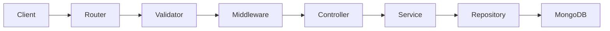

# Node REST API - Snippet

This repository powers the backend of a simple content-sharing application where users can create accounts, verify their email using a one-time code, securely log in, publish posts, and interact through comments.

The goal of this project wasn’t just to build another CRUD API. It was designed to reflect how modern backend applications are actually structured in professional environments. Alongside the core features, the project includes clean architecture patterns, a dedicated service layer, secure and consistent API responses, ownership and authorization checks, asynchronous email handling, Docker support, automated testing, and CI integration.

It’s part of the Code Snippet Collection, focused on showcasing scalable, maintainable, and production-ready backend practices rather than tutorial-style code packed into a single file.

---

## What problem does this solve?

Most beginner Node tutorials dump everything in one file: routes talk to Mongoose directly, passwords leak in JSON responses, and “validators” secretly load data from the database. That works until it doesn’t.

This snippet shows a cleaner split:

- **Controllers** only handle HTTP (request in, response out).
- **Services** hold the business rules (who can edit what, when to send email).
- **Repositories** talk to MongoDB.
- **Validators** only check input shape-not load users or posts.
- **Middleware** loads resources once and checks ownership before the controller runs.

If you’ve ever wondered “where should this logic live?” in an Express app, this repo is meant to answer that with working code, not just theory.

---

## What you’ll get out of reading / running it

- A full **auth flow**: sign-up → email OTP → verify → JWT login → protected routes.
- **Posts and comments** with pagination, cascade deletes, and ownership checks (you can’t edit someone else’s post).
- Patterns you’ll see in real teams: DTOs for API responses, typed errors (`404`, `403`, `422`), rate limiting, structured logs, health checks, Docker, CI, and **Swagger UI** to try the API in a browser.
- **19 integration tests** that hit the real HTTP layer (Jest + supertest + in-memory MongoDB).

It’s not a framework-it’s one app done in a way that scales if you add more features later.

---

## Tech stack

| Layer | Choice |
|-------|--------|
| Runtime | Node.js 18+ |
| Language | TypeScript (strict mode) |
| HTTP | Express 4 |
| Database | MongoDB via Mongoose 8 |
| Auth | JWT + bcrypt |
| Email | Nodemailer (queued after sign-up, not blocking the response) |
| Docs | Swagger UI at `/api/docs` (dev only) |
| Tests | Jest, supertest, mongodb-memory-server |

---

## How a request flows



Example: **edit a post**

1. `PostRouter` - route + JWT auth + validate `id` and `content`.
2. `PostMiddleware.loadPostById` - load post from DB, attach to `req.post`.
3. `PostMiddleware.requirePostOwnership` - 403 if `post.user_id` ≠ logged-in user.
4. `PostController.editPost` - pass `req.post` to the service (no second DB fetch).
5. `PostService.editPost` - update and return.
6. `PostRepository.updateDocument` - save on the document you already have.

Validators never touch the database for posts/comments. That’s intentional.

---

## Project structure

```
code-snippet-node/
├── src/
│   ├── index.ts              # Starts server, graceful shutdown
│   ├── app.ts                # Express app factory (used by tests too)
│   ├── database.ts           # MongoDB connect / disconnect
│   ├── config/
│   │   ├── env.ts            # Loads .env, fails fast if misconfigured
│   │   ├── logger.ts         # Pino logger
│   │   ├── swagger.ts        # OpenAPI spec
│   │   └── swagger.setup.ts  # Mounts /api/docs in development
│   ├── controllers/          # Thin HTTP handlers
│   │   ├── UserController.ts
│   │   ├── PostController.ts
│   │   └── CommentController.ts
│   ├── services/             # Business logic
│   │   ├── user.service.ts
│   │   ├── post.service.ts
│   │   ├── comment.service.ts
│   │   └── email.service.ts  # Async email queue after sign-up
│   ├── repositories/         # Mongoose queries
│   │   ├── user.repository.ts
│   │   ├── post.repository.ts
│   │   └── comment.repository.ts
│   ├── middlewares/
│   │   ├── GlobalMiddleware.ts   # JWT auth, validation errors
│   │   ├── PostMiddleware.ts     # Load post + ownership
│   │   └── CommentMiddleware.ts  # Load post / comment
│   ├── validators/           # express-validator rules only
│   ├── models/               # Mongoose schemas
│   ├── dto/                  # Safe API response shapes (no password leaks)
│   ├── errors/               # AppError, NotFound, Forbidden, etc.
│   ├── routers/              # Route definitions
│   ├── utils/                # Password hash, OTP, mailer
│   ├── interfaces/
│   └── types/
│       └── express.d.ts      # req.user, req.post, req.comment
├── tests/
│   ├── auth.test.ts
│   ├── post.test.ts
│   ├── comment.test.ts
│   └── helpers/
├── .github/workflows/ci.yml
├── Dockerfile
├── docker-compose.yml
└── .env.example
```

---

## Architecture layers (short version)

| Layer | Responsibility | Example |
|-------|----------------|---------|
| **Router** | URL, method, middleware chain | `PATCH /api/v1/post/edit/:id` |
| **Validator** | Is the body/param valid? | Email format, password length |
| **Middleware** | Auth, load `req.post`, check owner | `requirePostOwnership` |
| **Controller** | Call service, send status code | `res.send(await PostService.editPost(...))` |
| **Service** | Rules and orchestration | “Only owner can delete” |
| **Repository** | DB reads/writes | `Post.findById`, `post.save()` |
| **DTO** | What the client sees | User without `password` or OTP fields |

---

## Features

**User**

- Sign up with email verification (OTP sent in the background)
- Verify email, login (JWT), change password (authenticated)

**Post**

- Create, list (paginated), get by id, edit, delete - all scoped to the logged-in user

**Comment**

- Add comment on a post, edit/delete your own comments

**Ops**

- `GET /health` and `GET /health/ready`
- Rate limits on sign-up, login, verify
- Swagger UI in dev: http://localhost:5000/api/docs

---

## Requirements

- Node.js 18+
- MongoDB (local or Docker)
- SMTP settings for verification emails (or read OTP from the DB while testing)

---

## Setup

```bash
git clone https://github.com/digvijaysingh100/code-snippet-node.git
cd code-snippet-node
npm install
cp .env.example .env
```

Edit `.env` with your values. The app won’t start without a valid `DB_URL`, `JWT_SECRET` (32+ chars), and mail settings.

| Variable | What it’s for |
|----------|----------------|
| `DB_URL` | MongoDB connection string |
| `JWT_SECRET` | Signing login tokens (min 32 characters) |
| `MAIL_*` | SMTP for verification emails |
| `ALLOWED_ORIGINS` | CORS (comma-separated) |
| `LOG_LEVEL` | `info`, `debug`, or `silent` |
| `SWAGGER_ENABLED` | Set `false` to turn off `/api/docs` |

---

## Run

**Development** (auto-reload):

```bash
npm run dev
```

**Production:**

```bash
npm run build
npm start
```

**Tests** (no real Mongo or SMTP needed):

```bash
npm test
```

**Docker** (API + Mongo with healthcheck):

```bash
docker compose up --build
```

Use `DB_URL=mongodb://mongo:27017/code-snippet-node` in `.env` when running with Compose.

Check the server: http://localhost:5000/health

---

## Try the API in the browser (Swagger)

With `npm run dev` running, open:

**http://localhost:5000/api/docs**

Typical flow:

1. **POST /api/v1/user/sign-up**
2. **POST /api/v1/user/verify** - OTP from email, or from MongoDB:  
   `db.users.findOne({ email: "you@example.com" }, { verification_token: 1 })`
3. **POST /api/v1/user/login** - copy `token`
4. Click **Authorize** → `Bearer <token>`
5. Try post and comment endpoints

OpenAPI JSON: http://localhost:5000/api/docs.json

Swagger is off in production and during tests. Set `SWAGGER_ENABLED=false` to disable in dev.

---

## API routes

Base path: `/api/v1`

### User

| Method | Path | Auth | Description |
|--------|------|------|-------------|
| POST | `/user/sign-up` | No | Register |
| POST | `/user/verify` | No | Confirm OTP |
| POST | `/user/login` | No | Get JWT |
| PATCH | `/user/update/password` | Yes | Change password |

### Post

| Method | Path | Auth | Description |
|--------|------|------|-------------|
| POST | `/post/add` | Yes | Create post |
| GET | `/post/me?page=1&limit=20` | Yes | Your posts (paginated) |
| GET | `/post/:id` | Yes | Get one post |
| PATCH | `/post/edit/:id` | Yes | Edit (owner only) |
| DELETE | `/post/delete/:id` | Yes | Delete (owner only) |

### Comment

| Method | Path | Auth | Description |
|--------|------|------|-------------|
| POST | `/comment/add/:postId` | Yes | Add comment |
| PATCH | `/comment/edit/:id` | Yes | Edit (owner only) |
| DELETE | `/comment/delete/:id` | Yes | Delete (owner only) |

---

## Security notes

Worth knowing if you’re reviewing or extending this:

- Passwords and OTPs never appear in API responses (`UserResponseDto` strips them).
- Protected routes need `Authorization: Bearer <jwt>`.
- Users can only edit/delete their own posts and comments (`403` otherwise).
- Sign-up / login / verify are rate-limited in non-test environments.
- OTP uses `crypto.randomInt`, not `Math.random()`.
- Config is loaded from `.env`, not hardcoded TypeScript files.
- `helmet`, CORS allowlist, env validation at startup.

---

## CI

On every push/PR, GitHub Actions runs `npm ci`, `npm run build`, and `npm test`.

---


